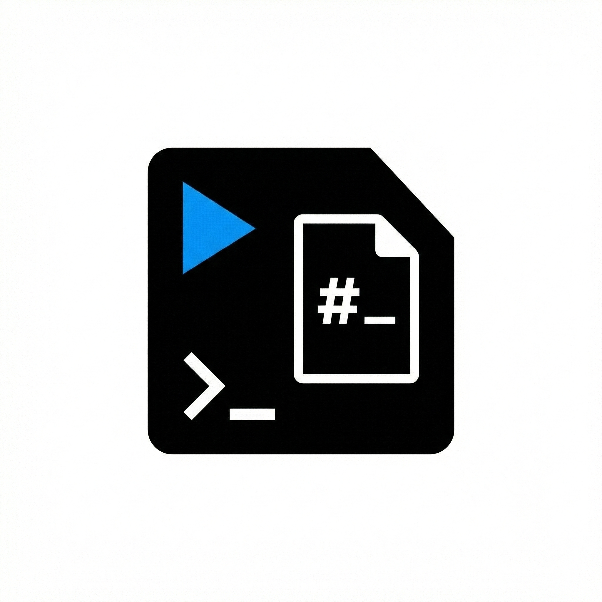
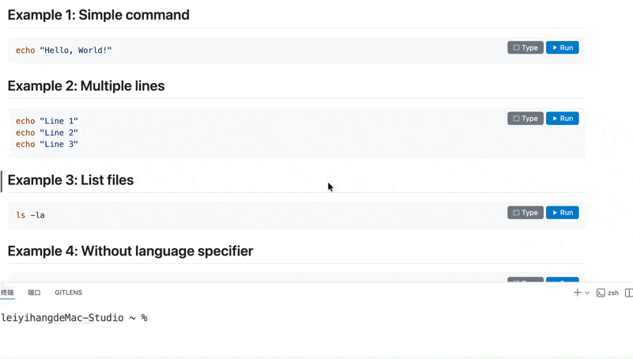

<div align="center">



# Markdown Run Terminal

### A Visual Studio Code Extension

**Run code blocks from Markdown files directly in the terminal with a single click**

[](https://marketplace.visualstudio.com/items?itemName=leiyihang.md-run-terminal)
[](https://github.com/Alexhang1314520/Markdown-Run-Terminal/releases)
[](https://opensource.org/licenses/MIT)

---

**Run** | **Type** | **50+ Languages** | **Multi-line Support** | **CodeLens & Preview**

[Install from VS Code Marketplace](#installation) · [Report Bug](https://github.com/Alexhang1314520/Markdown-Run-Terminal/issues) · [Request Feature](https://github.com/Alexhang1314520/Markdown-Run-Terminal/issues)

</div>

---

## Demo

<div align="center">



*Click **Run** to execute commands instantly, or **Type** to insert them into terminal*

</div>

---

## Why This Extension?

When reading documentation or tutorials in Markdown files, you often need to copy commands and paste them into the terminal. This extension eliminates that friction by adding **Run** and **Type** buttons directly to your code blocks.

---

## Features

### Run & Type Buttons

| Button | Action | Use Case |
|--------|--------|----------|
| **▶ Run** | Execute immediately | Quick command execution |
| **⌨ Type** | Insert without executing | Review before running |

### Works Everywhere in VS Code

| View | How It Works |
|------|--------------|
| **Editor** | CodeLens buttons appear above each code block |
| **Markdown Preview** | Interactive buttons overlay on code blocks |

### Multi-line Command Support

Execute multiple commands sequentially with automatic `&&` chaining:

```bash
# Install dependencies
cd frontend && npm install && cd ..

# Download Go dependencies
go mod download
```

Comments and empty lines are automatically filtered.

### Real-time Execution Animation

- Current command being executed
- Progress indicator (e.g., 2/3)
- Smooth completion animation

---

## Supported Languages

| Category | Languages |
|----------|-----------|
| **Shell** | `bash` `sh` `zsh` `powershell` `cmd` `fish` |
| **Scripting** | `python` `javascript` `typescript` `ruby` `perl` `php` `lua` |
| **Compiled** | `go` `rust` `java` `kotlin` `swift` `c` `cpp` `csharp` |
| **DevOps** | `docker` `kubectl` `npm` `yarn` `git` `make` `curl` |
| **Database** | `sql` `mysql` `postgresql` `sqlite` |

---

## Installation

### From VS Code (Recommended)

1. Open **VS Code**
2. Press `Cmd+Shift+X` (macOS) or `Ctrl+Shift+X` (Windows/Linux)
3. Search for **"Markdown Run Terminal"**
4. Click **Install**

### From Command Line

```bash
code --install-extension leiyihang.md-run-terminal
```

### From VSIX File

```bash
code --install-extension md-run-terminal-0.0.1.vsix
```

---

## Usage

### Quick Start

1. Open any `.md` file in VS Code
2. Look for **Run** and **Type** buttons on code blocks
3. Click to execute!

### Example

````markdown
```bash
echo "Hello, World!"
npm install
npm start
```
````

### Multi-line Execution

All commands in a code block are joined with `&&` and executed sequentially:

```bash
# This will run as: git clone ... && cd repo && npm install
git clone https://github.com/user/repo.git
cd repo
npm install
```

---

## Extension Settings

Open VS Code Settings (`Cmd+,` or `Ctrl+,`) and search for "Markdown Run Terminal":

| Setting | Default | Description |
|---------|---------|-------------|
| `md-run-terminal.reuseTerminal` | `true` | Reuse existing terminal |
| `md-run-terminal.supportedLanguages` | [50+ languages] | Languages that show buttons |

---

## How It Works

| Language Type | Execution Method |
|---------------|------------------|
| **Shell** (`bash`, `sh`, etc.) | Direct execution with `&&` joining |
| **Interpreted** (`python`, `js`, etc.) | Wrapped with interpreter |
| **Compiled** (`go`, `rust`, etc.) | Helpful compile suggestion |

**Examples:**
- Python: `python3 -c "print('hello')"`
- JavaScript: `node -e "console.log('hello')"`
- Go: Suggests `go run main.go`

---

## Requirements

- **VS Code** 1.85.0 or higher
- Language runtimes for execution (Node.js, Python, Go, etc.)

---

## Known Issues

- SQL blocks copy to clipboard (requires database client)
- Compiled languages need manual file save

---

## Contributing

Contributions welcome! Please submit a Pull Request.

1. Fork the repository
2. Create feature branch (`git checkout -b feature/Amazing`)
3. Commit changes (`git commit -m 'Add Amazing'`)
4. Push (`git push origin feature/Amazing`)
5. Open Pull Request

---

## License

[MIT License](LICENSE) © 2024 leiyihang

---

<div align="center">

**Made for developers who work with Markdown**

Built with ❤️ for the VS Code community

[](https://github.com/Alexhang1314520/Markdown-Run-Terminal)

</div>
